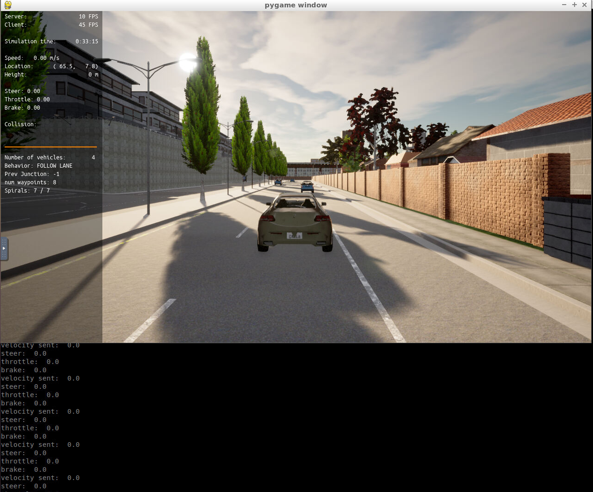
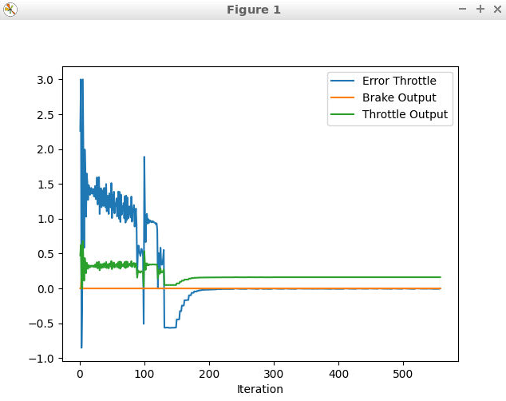
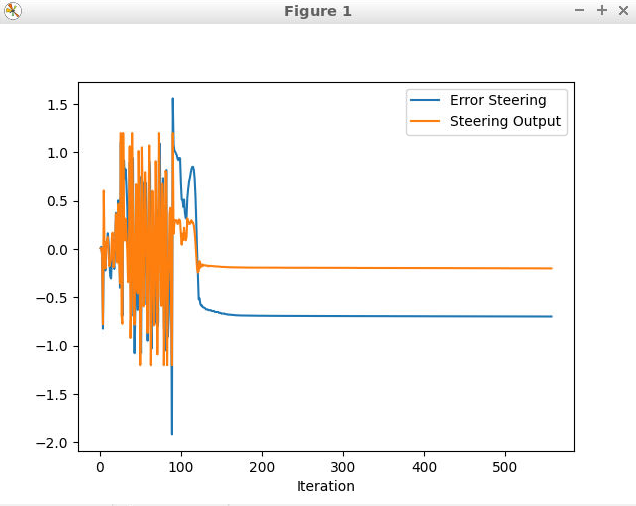

# Udacity Control and Trajectory Tracking for Autonomous Vehicles Project

The final project for the Self Driving Car Engineer Nanodegree program was to implement a PID (projection, integral, and differential) controller to perform vehicle trajectory tracking.

The first section was to implement the PID controller and capture a screenshot of the simulator not moving:

After implementing the main.cpp todo sections, I did have to make modifications to the pid controller implementation.

The second portion was to add implementation to the pid steering and throttle in the main function. This can be found in project/pid_controller.

## Add the plots to your report and explain them (describe what you see)

Here are my plots from the generated analysis report from my final run:

From my plots, the initial iterations the control error is oscilating quite a bit. During the run, this is very obvious as the erratic behavior from CARLA from the beginning and as the vehicle progresses, it slightly improves.

Also worth noting is that I had a hard time adjusting the parameters to get a good result. After searching the Udacity Knowledge forums, I found better parameters and a suggestion to use the closest point to get a better steering and throttle error. I tried fine tuning it some more but wasn't successful.

## What is the effect of the PID according to the plots, how each part of the PID affects the control command?

The proportional term greatly effects the variablitly of the error. If the P term is too high, the vehicle becomes unstable; however, if it's too low, it's less responsive. Therefore, it has the greatest impact on fine tuning the vehicle's control.

The integral term keeps track of the history of the error which makes the response stronger. In general, I found keeping it smaller worked best.

The derivative term predicts the behavior and proves the settling time and stability of the vehicle.

Although the proportional term has the greatest influence, all three play a key role in fine tuning the control error.

## PID controller is a model free controller, i.e. it does not use a model of the car. Could you explain the pros and cons of this type of controller?

Pros:
  - Simple and lightweight
  - Not compute intensive
  - Good for managing speed in easy environments (i.e. cruise control on the highway)

Cons:
  - High oscillation and instable (i.e. jerky, overshooting movements)
  - Generally, doesn't provide optimal control especially in complex environments (e.g. congested roads)

## How would you design a way to automatically tune the PID parameters?

I would implement an algorithm like the Twiddle algorithm to get a more well tuned parameters for the PID controller. After messing with those values a long time, it's pretty clear from the jerky and unstable steering, that having optimial PID parameters is essential.

## What would you do to improve the PID controller?

I would have implemented the Twiddle algorithm or something similar to fine tune the parameters. I also wouldn't just use a PID controller to control the vehicle. Instead, I would use a feed-forward controller that has knowledge about the vehicle and only use the PID controllers to maintain the control error.
